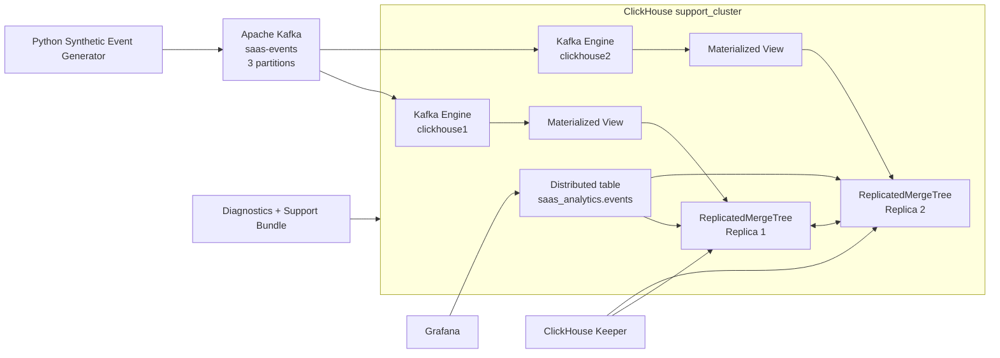

# ClickHouse Customer Support Engineering Lab

[](https://github.com/dwaradwara/clickhouse-customer-support-lab/actions/workflows/ci.yml)

A reproducible customer-support engineering lab built around ClickHouse, Apache Kafka, replicated analytics workloads, incident troubleshooting, diagnostics, customer communication, and engineering escalation.

This project models a small multi-tenant SaaS analytics platform and deliberately introduces realistic failure conditions so they can be reproduced, investigated, fixed, and validated with evidence.

> This is a controlled portfolio and learning environment. It does not represent commercial ClickHouse production experience, and the incidents in this repository are synthetic lab scenarios.

## What This Project Demonstrates

- ClickHouse Kafka Engine ingestion with `JSONEachRow`
- Materialized View based streaming ingestion
- `ReplicatedMergeTree` across two ClickHouse replicas
- Distributed table query access
- ClickHouse Keeper coordination
- Kafka consumer and partition troubleshooting
- query-performance diagnosis using ordering-key behavior
- MergeTree active-parts troubleshooting
- replica outage and recovery analysis
- memory-limit failure investigation
- TTL and retention troubleshooting
- ClickHouse roles and grants diagnosis
- Grafana observability with a read-only ClickHouse account
- reusable Bash and Python diagnostics
- automated support-bundle collection
- controlled 20-million-row performance benchmarking
- end-to-end smoke testing
- GitHub Actions CI
- customer-facing and engineering-facing incident documentation

## Project Status

The core lab is functional and validated.

Implemented:

- two-node ClickHouse cluster
- ClickHouse Keeper
- Apache Kafka with three partitions
- Python synthetic event generator
- Kafka Engine and Materialized View ingestion
- ReplicatedMergeTree and Distributed tables
- Grafana dashboard
- five diagnostic tools
- support-bundle collector
- 100k and 500k ingestion baselines
- 20-million-row ordering-key benchmark
- seven complete reproducible incidents
- three support knowledge-base articles
- architecture and troubleshooting documentation
- end-to-end smoke tests
- GitHub Actions CI

## Architecture



Detailed architecture:

- [System architecture](docs/architecture/architecture.md)
- [Troubleshooting decision tree](docs/architecture/troubleshooting-decision-tree.md)

## Data Flow

```text
Python generator
    -> Kafka topic: saas-events
    -> ClickHouse Kafka Engine
    -> Materialized View
    -> ReplicatedMergeTree
    -> Distributed table
    -> support queries / Grafana
```

The primary event model contains:

- `event_id`
- `tenant_id`
- `user_id`
- `event_type`
- `service_name`
- `region`
- `status_code`
- `duration_ms`
- `deployment_version`
- `event_timestamp`
- `payload`

## ClickHouse Storage Design

Primary replicated table:

`saas_analytics.events_local`

Engine:

`ReplicatedMergeTree`

Partitioning:

`toYYYYMM(event_timestamp)`

Ordering key:

```text
(tenant_id, service_name, event_type, event_timestamp)
```

Query-facing table:

`saas_analytics.events` using the Distributed engine.

## Incident Catalog

Seven controlled incidents cover different ClickHouse support domains.

| Incident | Domain | Main failure |
| --- | --- | --- |
| [INC-001](incidents/INC-001-kafka-schema-mismatch/) | Kafka ingestion | Schema mismatch blocks one Kafka partition |
| [INC-002](incidents/INC-002-slow-query-ordering-key/) | Query performance | Ordering key does not match the access pattern |
| [INC-003](incidents/INC-003-excessive-active-parts/) | Storage / inserts | Tiny inserts create excessive active parts |
| [INC-004](incidents/INC-004-replica-failure/) | Replication | One ClickHouse replica becomes unavailable |
| [INC-005](incidents/INC-005-memory-limit/) | Query resources | Aggregation exceeds a controlled memory limit |
| [INC-006](incidents/INC-006-broken-ttl/) | TTL / retention | 365-day TTL configured instead of intended 7 days |
| [INC-007](incidents/INC-007-access-control/) | Authorization | Assigned role lacks required table SELECT privilege |

See the full [incident catalog](incidents/README.md) for symptoms, root causes, measured evidence, and navigation into each case.

Each incident includes:

- customer ticket
- triage notes
- investigation
- root-cause analysis
- resolution
- customer response
- engineering escalation
- prevention guidance
- failure-injection script
- validation script
- captured evidence

## 20-Million-Row Query Benchmark

The query-performance POC compares two physical ordering strategies against the same controlled dataset and query result.

Affected ordering key:

```text
(event_timestamp, event_id)
```

Workload-aligned ordering key:

```text
(tenant_id, service_name, event_type, event_timestamp)
```

Measured comparison:

| Metric | Poor ordering design | Workload-aligned design |
| --- | ---: | ---: |
| Dataset size | 20,000,000 rows | 20,000,000 rows |
| Rows read | 6,696,000 | 24,576 typical |
| Selected marks | 818 | 3 typical |
| Query result | identical | identical |

This represents approximately **272x fewer rows read** and **273x fewer selected marks** for the controlled query pattern.

The repository emphasizes rows read and marks selected rather than treating one wall-clock timing measurement as a universal performance claim.

See:

- [20M ordering-key comparison](benchmarks/20m-ordering-key-comparison.md)
- [20M POC SQL](poc/20m-events/)

Additional workload baselines:

- [100k live ingestion baseline](benchmarks/100k-live-ingestion-baseline.md)
- [500k end-to-end ingestion](benchmarks/500k-end-to-end-ingestion.md)

## Support Diagnostics

Reusable diagnostic scripts:

```text
diagnostics/check-cluster-health.sh
diagnostics/check-kafka-consumers.sh
diagnostics/check-query-health.sh
diagnostics/check-replication.sh
diagnostics/check-storage-parts.sh
```

Run all diagnostics:

```bash
make diagnostics
```

The checks cover:

- node and cluster health
- Kafka consumer state and exceptions
- query failures and expensive queries
- replica state and replication queues
- partitions, storage, and active parts

## Support Bundle

The repository includes automated support-bundle collection:

```bash
make support-bundle
```

The collector packages diagnostic evidence into a timestamped archive and checksum for troubleshooting or escalation.

It is designed to exclude `.env.local` and credential values.

## Observability

Grafana is provisioned automatically with a ClickHouse datasource using a dedicated read-only account.

The ClickHouse support dashboard contains nine panels:

- Total Events
- Error Events
- Active Tenants
- P95 Duration
- Event Volume Over Time
- Error Volume Over Time
- Replica Health
- Kafka Consumer Health
- Recent Expensive Queries

Dashboard definition:

`grafana/provisioning/dashboards/json/clickhouse-support-overview.json`

## End-to-End Smoke Test

The smoke test validates the actual ingestion and replication path, not only container availability.

```bash
make smoke
```

It verifies:

1. both ClickHouse nodes respond
2. `support_cluster` contains two nodes
3. expected ClickHouse table engines exist
4. ReplicatedMergeTree health is clean
5. Kafka topic has three partitions
6. Kafka Engine tables exist on both ClickHouse nodes
7. a unique event can be produced into Kafka
8. the event reaches ClickHouse through the Kafka Engine and Materialized View
9. the event converges to both replicas

The same test runs in GitHub Actions on pushes and pull requests to `main`.

## Knowledge Base

Support-oriented KB articles:

- [KB-001 - Kafka schema mismatch](docs/knowledge-base/kb-001-kafka-schema-mismatch.md)
- [KB-002 - Slow query and ordering-key mismatch](docs/knowledge-base/kb-002-slow-query-ordering-key.md)
- [KB-003 - Replica failure and recovery](docs/knowledge-base/kb-003-replica-failure-recovery.md)

## Quick Start

### Requirements

- Docker Engine or Docker Desktop
- Docker Compose
- GNU Make
- Bash

Windows users can run the Make targets through WSL.

### 1. Clone the repository

```bash
git clone https://github.com/dwaradwara/clickhouse-customer-support-lab.git
cd clickhouse-customer-support-lab
```

### 2. Create local credentials

Create `.env.local` in the repository root:

```text
CLICKHOUSE_CLUSTER_PASSWORD=replace-with-local-password
CLICKHOUSE_GRAFANA_PASSWORD=replace-with-local-password
```

`.env.local` is ignored by Git.

### 3. Start and bootstrap the lab

```bash
make bootstrap
```

This:

- starts Docker Compose services
- waits for ClickHouse and Kafka readiness
- creates or verifies the Kafka topic
- applies the ClickHouse schema

### 4. Run the smoke suite

```bash
make smoke
```

### 5. Run diagnostics

```bash
make diagnostics
```

### 6. Stop the environment

```bash
make down
```

## Useful Make Targets

| Command | Purpose |
| --- | --- |
| `make up` | Start lab services |
| `make down` | Stop lab services |
| `make wait` | Wait for ClickHouse and Kafka readiness |
| `make kafka-topic` | Create or verify `saas-events` |
| `make schema` | Apply ClickHouse schema |
| `make bootstrap` | Start and initialize the lab |
| `make smoke` | Run end-to-end smoke tests |
| `make diagnostics` | Run support diagnostic checks |
| `make support-bundle` | Collect troubleshooting evidence |
| `make incident-syntax` | Syntax-check all incident scripts |
| `make versions` | Display pinned component versions |

## Local Endpoints

| Service | Endpoint |
| --- | --- |
| ClickHouse 1 HTTP | `localhost:8123` |
| ClickHouse 1 native | `localhost:9000` |
| ClickHouse 2 HTTP | `localhost:8124` |
| ClickHouse 2 native | `localhost:9001` |
| Kafka | `localhost:9092` |
| ClickHouse Keeper | `localhost:9181` |
| Grafana | `localhost:3000` |

## Pinned Component Versions

| Component | Version |
| --- | --- |
| ClickHouse | `26.8.2.7` |
| ClickHouse Keeper | `26.8.2.7` |
| Apache Kafka | `4.3.1` |
| Grafana | `13.0.9` |
| Grafana ClickHouse plugin | `4.21.3` |

Pinned values are maintained in `versions.env`.

## Repository Structure

```text
.github/workflows/      GitHub Actions CI
benchmarks/             Measured ingestion and query benchmarks
clickhouse/             Cluster, user, and node configuration
diagnostics/            Support diagnostic and bundle tooling
docs/architecture/      Architecture and troubleshooting flow
docs/knowledge-base/    Support knowledge-base articles
generator/              Synthetic SaaS event generator
grafana/                Provisioning and dashboard configuration
incidents/              Seven reproducible support incidents
kafka/                  Kafka topic setup
keeper/                 ClickHouse Keeper configuration
poc/20m-events/         20-million-row performance POC
scripts/                Python support-bundle wrapper
sql/                    ClickHouse schemas and smoke queries
tests/smoke/            End-to-end architecture validation
compose.yaml            Local multi-service environment
Makefile                Operational entry points
versions.env            Pinned component versions
```

## Support Methodology

The incident work follows a consistent support pattern:

```text
customer symptom
  -> reproduce
  -> collect evidence
  -> identify failing layer
  -> form hypothesis
  -> controlled fix
  -> validate original operation
  -> verify adjacent boundaries
  -> customer communication
  -> engineering escalation
  -> prevention
```

The goal is to avoid treating symptoms as root causes and to preserve evidence before making changes.

## Design Boundaries

This project intentionally stays focused on ClickHouse customer-support depth.

It does not add Kubernetes, Terraform, Redis, Nginx, or unrelated infrastructure solely to make the architecture appear larger.

The single Keeper instance and single Kafka broker are deliberate lab simplifications. They should not be interpreted as production high-availability recommendations.

## Scope and Accuracy

All incidents are synthetic and reproducible.

All numerical incident and benchmark results shown in this repository come from captured lab executions.

No commercial ClickHouse experience is claimed.

The project is intended to demonstrate troubleshooting methodology, technical investigation, support communication, evidence collection, and the ability to reason about ClickHouse behavior in a controlled environment.
