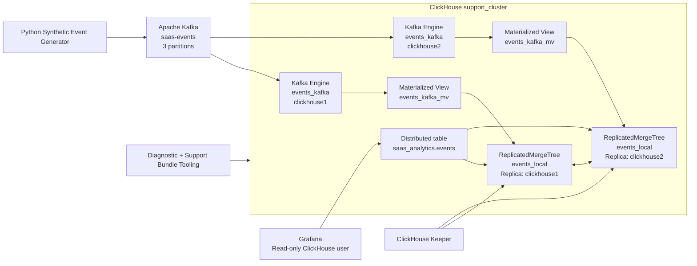

# ClickHouse Customer Support Engineering Lab - Architecture

## Overview

This lab models a small multi-tenant SaaS analytics platform built to exercise ClickHouse customer-support and troubleshooting scenarios.

Operational events are produced through Apache Kafka and consumed by ClickHouse using the Kafka Engine. A Materialized View writes the events into a replicated storage table, while a Distributed table provides the query-facing abstraction.

The environment uses two ClickHouse nodes and ClickHouse Keeper so replication, replica failures, query behavior, storage issues, ingestion problems, and access-control incidents can be reproduced and investigated.

## Architecture



## Data Flow

1. The Python generator creates synthetic SaaS operational events.
2. Events are published to the Kafka topic `saas-events`.
3. The topic contains three partitions.
4. ClickHouse Kafka Engine tables consume the Kafka stream.
5. `events_kafka_mv` Materialized Views forward parsed rows into `events_local`.
6. `events_local` uses `ReplicatedMergeTree` across the two ClickHouse replicas.
7. ClickHouse Keeper coordinates replicated-table metadata and replication state.
8. `saas_analytics.events` is a Distributed table used as the query-facing abstraction.
9. Grafana connects with a dedicated read-only account.
10. Diagnostic scripts inspect cluster, Kafka consumer, query, replication, storage, and parts health.

## Core Event Schema

Each SaaS event contains:

- `event_id`
- `tenant_id`
- `user_id`
- `event_type`
- `service_name`
- `region`
- `status_code`
- `duration_ms`
- `deployment_version`
- `event_timestamp`
- `payload`

## ClickHouse Storage Design

The primary replicated table is:

`saas_analytics.events_local`

Engine:

`ReplicatedMergeTree`

Partitioning:

`toYYYYMM(event_timestamp)`

Ordering key:

```text
(tenant_id, service_name, event_type, event_timestamp)
```

The ordering key is intentionally aligned with the analytical access pattern demonstrated in the 20-million-row query-performance benchmark.

## Cluster Layout

The lab uses:

- one shard
- two replicas
- `clickhouse1`
- `clickhouse2`
- cluster name: `support_cluster`

A single ClickHouse Keeper instance is used because this is a controlled support lab rather than a production highly available Keeper deployment.

## Kafka Ingestion

Kafka configuration used by ClickHouse:

- topic: `saas-events`
- partitions: `3`
- format: `JSONEachRow`
- consumer group: `clickhouse-saas-events-v1`
- one Kafka Engine consumer per ClickHouse node

The end-to-end smoke test publishes a unique event into Kafka and verifies that it reaches ClickHouse through the Kafka Engine and Materialized View and is present on both replicas.

## Observability

Grafana is provisioned with a ClickHouse datasource using the dedicated `grafana_reader` account.

The dashboard covers:

- total events
- error events
- active tenants
- P95 duration
- event volume over time
- error volume over time
- replica health
- Kafka consumer health
- recent expensive queries

## Support Diagnostics

Reusable diagnostics cover:

- cluster health
- Kafka consumers
- query health and failures
- replication state and queue
- storage, partitions, and active parts
- support-bundle collection

The support bundle captures troubleshooting context without including `.env.local` or repository secrets.

## Failure Domains Exercised

The lab contains seven reproducible support incidents:

1. Kafka schema mismatch
2. Slow query caused by poor ordering key
3. Excessive active parts caused by tiny inserts
4. Replica failure and recovery
5. Query memory-limit failure
6. Broken TTL / retention configuration
7. Roles and grants permission denial

Each incident contains failure injection, validation, evidence, customer communication, triage, root cause, resolution, engineering escalation, and prevention documentation.

## Validation

The repository includes an end-to-end smoke suite that verifies:

- both ClickHouse nodes respond
- the cluster contains two nodes
- expected ClickHouse engines exist
- replication is healthy
- Kafka has three partitions
- Kafka Engine tables exist on both nodes
- a real Kafka event reaches ClickHouse
- the Materialized View ingestion path works
- the event converges to both replicas

The same smoke suite runs in GitHub Actions.

## Scope

This is a portfolio and learning environment. It does not represent commercial ClickHouse production experience, and all incidents and measurements are generated from controlled lab executions.
