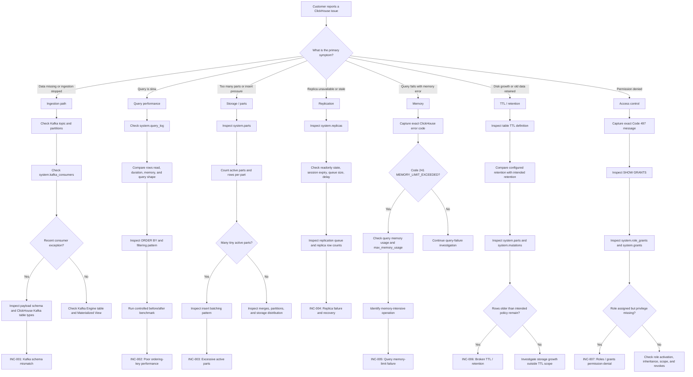

# ClickHouse Support Troubleshooting Decision Tree

## Purpose

This decision tree provides a structured first-response workflow for ClickHouse customer-support incidents in this lab.

The goal is to move from customer symptom to the correct diagnostic domain before making configuration changes.

## Decision Tree



## 1. Ingestion Failures

Start with the complete ingestion chain:

```text
producer
  -> Kafka topic
  -> partition assignment
  -> ClickHouse Kafka Engine
  -> Materialized View
  -> ReplicatedMergeTree
```

Useful checks:

- confirm the Kafka topic exists
- confirm expected partition count
- inspect `system.kafka_consumers`
- inspect recent consumer exceptions
- compare incoming JSON fields with the Kafka Engine table schema
- confirm the Materialized View exists and targets the expected table

Relevant incident:

- `INC-001-kafka-schema-mismatch`

## 2. Slow Queries

Do not begin by increasing hardware or memory limits.

First inspect:

- query duration
- rows read
- bytes read
- memory usage
- filter predicates
- table ordering key
- partitions touched

A query can be syntactically correct and still perform poorly when the primary ordering key does not align with the access pattern.

Relevant incident:

- `INC-002-slow-query-ordering-key`

## 3. Excessive Parts

Use `system.parts` to determine:

- active part count
- rows per part
- partition distribution
- smallest and largest parts

If many tiny parts are present, inspect the application insert pattern before treating merges as the root cause.

Relevant incident:

- `INC-003-excessive-active-parts`

## 4. Replication Problems

Inspect `system.replicas` for:

- `is_readonly`
- `is_session_expired`
- `queue_size`
- `inserts_in_queue`
- `merges_in_queue`
- `absolute_delay`

Then compare replica row counts and replication-queue state.

Relevant incident:

- `INC-004-replica-failure`

## 5. Memory Failures

For `MEMORY_LIMIT_EXCEEDED`, capture:

- exact error code
- configured `max_memory_usage`
- observed query memory
- rows processed
- query operation causing allocation pressure

Changing a memory limit without understanding the query should not be the first troubleshooting action.

Relevant incident:

- `INC-005-memory-limit`

## 6. TTL and Disk Growth

Compare the intended retention policy with the actual table metadata.

Inspect:

- `SHOW CREATE TABLE`
- rows older than the intended retention window
- active storage by partition
- `system.mutations`
- TTL materialization behavior

Do not assume that retained old data means the TTL processor itself is broken. A configuration mismatch can produce the same customer symptom.

Relevant incident:

- `INC-006-broken-ttl`

## 7. Permission Failures

For Code 497 / `ACCESS_DENIED`, verify the complete authorization path:

```text
user
  -> assigned role
  -> active role
  -> required privilege
  -> correct database/table scope
```

Useful checks:

- `SHOW GRANTS FOR <user>`
- `SHOW GRANTS FOR <role>`
- `system.role_grants`
- `system.grants`

Apply the minimum privilege required by the failing operation and verify that operations outside the intended scope remain denied.

Relevant incident:

- `INC-007-access-control`

## Cross-Cutting Support Workflow

For any incident:

1. Reproduce the customer symptom.
2. Capture the exact query, error code, timestamp, and affected object.
3. Identify the failing layer before making changes.
4. Gather evidence from ClickHouse system tables and logs.
5. Form a testable root-cause hypothesis.
6. Apply the smallest safe corrective action.
7. Re-run the original customer operation.
8. Validate adjacent failure boundaries.
9. Record before/after evidence.
10. Document customer response, engineering escalation, and prevention.

## Support Bundle

When the failure domain is unclear, collect the repository support bundle to capture cluster, replication, query, Kafka consumer, and storage context before deeper escalation.

The support bundle is designed to exclude `.env.local` and credential values.

## Escalation Principle

Escalate to engineering when the available evidence indicates that the observed behavior is not explained by customer configuration, documented operational state, or a reproducible workload condition.

An escalation should include:

- customer symptom
- reproducible query or action
- exact ClickHouse error
- environment and version
- relevant system-table evidence
- troubleshooting already performed
- current hypothesis
- customer impact
- requested engineering action

## Scope

This decision tree is based on controlled synthetic incidents in the ClickHouse Customer Support Engineering Lab.
